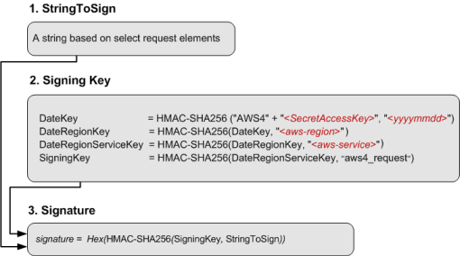

# RCurlConnection S3 Extension: Implementation and Testing Notes

## What the code does

`RCurlConnection` handles HTTP HEAD and range GET requests via libcurl, but had no way to attach authentication headers. This extends it to support AWS Signature Version 4 so it can talk to authenticated S3 buckets. Both `SendHeadReq()` and `SendRangesReq()` now sign requests when credentials are present and clean up immediately after the transfer completes.

---

## Build and Environment Setup

**Platform:** macOS ARM64 (Apple Silicon)

One thing worth noting: ROOT's build system silently disables the `net/curl` backend if it cannot definitively locate the `libcurl` dependency. This results in a `libNet.so` that lacks `RCurlConnection` symbols entirely, which causes macros to fail at runtime with linker errors that are not immediately obvious. A clean out-of-source build with explicit flags avoids this:

```bash
mkdir root-build && cd root-build
cmake ../root \
  -DCMAKE_BUILD_TYPE=Release \
  -Ds3=ON \
  -Dcurl=ON \
  -Dbuiltin_openssl=ON \
  -DCMAKE_PREFIX_PATH=$(brew --prefix curl)

make -j$(sysctl -n hw.ncpu)
```

To confirm the curl backend actually compiled into the networking library:

```bash
nm -gU lib/libNet.so | grep RCurlConnection
```

---

## How AWSv4 Signing Works

The signing process follows the official AWS specification:
- [Authenticating Requests (AWS Signature Version 4)](https://docs.aws.amazon.com/AmazonS3/latest/API/sig-v4-authenticating-requests.html)
- [Create a signed request](https://docs.aws.amazon.com/IAM/latest/UserGuide/reference_sigv-create-signed-request.html)

There are three stages:

### 1. Build a Canonical Request

The canonical request is a normalized string of the HTTP request — method, URI path, query string, headers, signed header names, and a SHA256 hash of the payload. For HEAD and range GET requests the payload is always empty, so the payload hash is always:

```
e3b0c44298fc1c149afbf4c8996fb92427ae41e4649b934ca495991b7852b855
```

Headers must be sorted alphabetically by name. For a GET request with a range header the order is:

```
host:<value>
range:bytes=<value>
x-amz-date:<value>
```

### 2. Derive the Signing Key

The signing key is not the raw secret — it is derived through a chain of four HMAC-SHA256 operations, each building on the previous output:



```cpp
kDate    = HMAC-SHA256("AWS4" + SecretKey, dateStamp)
kRegion  = HMAC-SHA256(kDate,   region)
kService = HMAC-SHA256(kRegion, "s3")
kSigning = HMAC-SHA256(kService, "aws4_request")
```

The intermediate outputs are raw binary and get passed directly into the next HMAC call. Only the final signature is hex-encoded.

### 3. Compute the Final Signature

```
signature = Hex(HMAC-SHA256(kSigning, StringToSign))
```

The `StringToSign` combines the algorithm name, timestamp, credential scope, and a SHA256 hash of the canonical request.

---

## What Was Changed

The header file got a new `RS3Credentials` struct to hold the access key, secret key, region, and an optional session token for temporary IAM credentials. A public `SetS3Credentials()` method lets callers inject credentials into a connection object, and a private `fHasS3Credentials` boolean means non-S3 requests pay zero overhead since the check is just a flag read.

On the implementation side, three helper functions went into the existing anonymous namespace — `Sha256Hex` for hashing the canonical request, `HmacSha256` for the intermediate key derivation steps which need raw binary output, and `HmacSha256Hex` for the final signature which needs hex. Having two separate HMAC functions matters because feeding hex into the middle of the key chain would break it — the intermediate steps need to stay as raw binary all the way through.

The actual signing happens in `ApplyS3Auth()` which builds the canonical request, runs the key chain, constructs the `Authorization` header, and returns a `curl_slist`. Both `SendHeadReq()` and `SendRangesReq()` call it before `Perform()` when credentials are set and free the list right after. In `SendRangesReq()` this happens inside the batch loop because the `Range` header changes per batch and needs to be part of the signature each time — if the signed range and the actual sent range differ, S3 will reject it.

### Coding conventions

The implementation tried to follow ROOT's coding conventions throughout (https://root.cern/contribute/coding_conventions/). Member variables use the `f` prefix (`fS3Credentials`, `fHasS3Credentials`) which is standard across the codebase. C-style casts were avoided in favour of `reinterpret_cast`, binary data is handled with explicit-length `std::string` constructors, and the helper functions sit inside the anonymous namespace to keep things scoped — same as the rest of `RCurlConnection.cxx`.

---

## Error Encountered: HMAC Null-Byte Truncation

During testing on macOS ARM64 the signing logic was producing signatures much shorter than the expected 64 hex characters.

The HMAC-SHA256 function generates a 32-byte raw binary hash which often contains null bytes (`0x00`). When this binary output was passed between key derivation steps using a standard C-string constructor, the string cut off at the first null byte so the full 32 bytes were not getting through. The downstream HMAC calls were then working with a truncated key.

The fix is to always pass the explicit byte length:

```cpp
return std::string(reinterpret_cast<char*>(hash), hashLen);
```

After this, signatures were consistently 64 characters.

---

## Testing

### HMAC correctness

Before touching the ROOT codebase, the helper functions were pulled into a standalone `.cxx` file and tested against a known input to make sure the math was right before integration:

```cpp
// HMAC-SHA256("key", "The quick brown fox jumps over the lazy dog")
// Expected: f7bc83f430538424b13298e6aa6fb143ef4d59a14946175997479dbc2d1a3cd8
std::string result = HmacSha256Hex("key", "The quick brown fox jumps over the lazy dog");
```

Output matched.

### Manual cross-check against AWS docs

The canonical request format, `StringToSign` structure, and `Authorization` header format were traced through step by step against the examples in the [AWS SigV4 documentation](https://docs.aws.amazon.com/IAM/latest/UserGuide/reference_sigv-create-signed-request.html) to verify the alphabetical header sorting, empty payload hash, and credential scope format were all correct.

### Python mock server

Wrote a local Python HTTP server to intercept ROOT's `HEAD` and `GET` requests and look at the raw headers without needing live AWS credentials:

```python
from http.server import HTTPServer, BaseHTTPRequestHandler

class S3Mock(BaseHTTPRequestHandler):
    def do_HEAD(self):
        auth = self.headers.get('Authorization', 'MISSING')
        date = self.headers.get('x-amz-date', 'MISSING')
        print(f"Authorization: {auth}")
        print(f"x-amz-date:    {date}")
        if auth.startswith("AWS4-HMAC-SHA256") and len(auth.split("Signature=")[-1]) == 64:
            print("[PASS] Header format and signature length correct")
        self.send_response(200)
        self.end_headers()

    def do_GET(self):
        auth    = self.headers.get('Authorization', 'MISSING')
        range_h = self.headers.get('range', 'MISSING')
        print(f"Authorization: {auth}")
        print(f"range:         {range_h}")
        if range_h != 'MISSING' and "range" in auth:
            print("[PASS] Range header present and included in SignedHeaders")
        self.send_response(206)
        self.end_headers()

HTTPServer(('127.0.0.1', 9000), S3Mock).serve_forever()
```

Used this to verify the `Authorization` header format, that signatures are consistently 64 hex characters, that `range` shows up in `SignedHeaders` for GET requests but not HEAD, and that plain HTTP connections without credentials set get no extra headers to make sure nothing broke.
