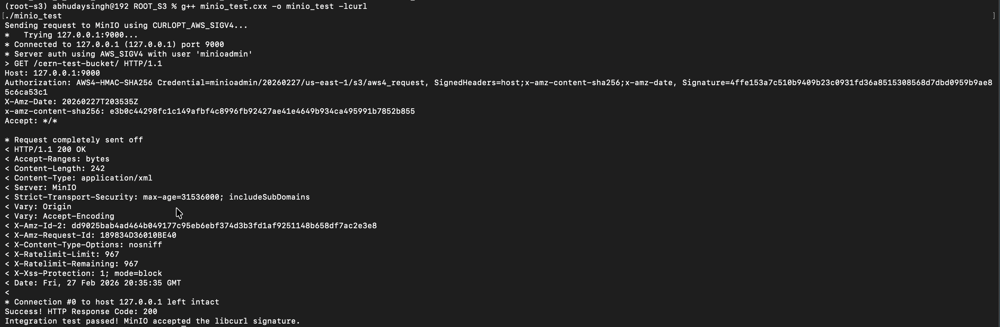

# RCurlConnection S3 Extension: Implementation and Testing Notes

## What the code does

`RCurlConnection` handles HTTP HEAD and range GET requests via libcurl, but has no way to attach authentication headers. This extends it to support AWS Signature Version 4 so it can talk to authenticated S3 buckets. Rather than implementing the signing chain manually, the implementation delegates to libcurl's built-in `CURLOPT_AWS_SIGV4` option — credentials go in via `CURLOPT_USERPWD` and libcurl handles the full signing chain internally. Both `SendHeadReq()` and `SendRangesReq()` set these options when credentials are present.


## Build and Environment Setup

**Platform:** macOS ARM64 (Apple Silicon)

Building ROOT from source on macOS 15 with AppleClang 17 hits a known LLVM/AArch64 target registration issue in ROOT's internal Cling interpreter that currently prevents a clean compile. ROOT was installed via conda-forge instead, which provides a pre-built binary that works cleanly on ARM64:

```bash
conda create -c conda-forge --name root-s3 root
conda activate root-s3
root --version
```

For the modified files specifically, compiling `minio_test.cxx` directly against the system libcurl was enough to verify the signing approach:

```bash
g++ minio_test.cxx -o minio_test -lcurl
./minio_test
```

## How AWSv4 Signing Works

Understanding the signing chain was necessary to verify that libcurl was doing the right thing and to write meaningful tests. The signing process follows the official AWS specification:
- [Authenticating Requests (AWS Signature Version 4)](https://docs.aws.amazon.com/AmazonS3/latest/API/sig-v4-authenticating-requests.html)
- [Create a signed request](https://docs.aws.amazon.com/IAM/latest/UserGuide/reference_sigv-create-signed-request.html)

There are three stages:

### 1. Build a Canonical Request

The canonical request is a normalised string of the HTTP request method, URI path, query string, headers, signed header names, and a SHA256 hash of the payload. For HEAD and range GET requests, the payload is always empty, so the payload hash is always:

```
e3b0c44298fc1c149afbf4c8996fb92427ae41e4649b934ca495991b7852b855
```

Headers must be sorted alphabetically by name. For a GET request with a range header, the order is:

```
host:<value>
range:bytes=<value>
x-amz-date:<value>
```

### 2. Derive the Signing Key

The signing key is not the raw secret; it is derived through a chain of four HMAC-SHA256 operations, each building on the previous output:


```cpp
kDate    = HMAC-SHA256("AWS4" + SecretKey, dateStamp)
kRegion  = HMAC-SHA256(kDate,   region)
kService = HMAC-SHA256(kRegion, "s3")
kSigning = HMAC-SHA256(kService, "aws4_request")
```

### 3. Compute the Final Signature

```
signature = Hex(HMAC-SHA256(kSigning, StringToSign))
```

The `StringToSign` combines the algorithm name, timestamp, credential scope, and a SHA256 hash of the canonical request.


## What Was Changed

The header file got a new `RS3Credentials` struct to hold the access key, secret key, region, and an optional session token for temporary IAM credentials. A public `SetS3Credentials()` method lets callers inject credentials into a connection object, and a private `fHasS3Credentials` boolean means non-S3 requests pay zero overhead since the check is just a flag read.

On the implementation side, both `SendHeadReq()` and `SendRangesReq()` were updated to call `curl_easy_setopt` with `CURLOPT_AWS_SIGV4` and `CURLOPT_USERPWD` when credentials are set. The `CURLOPT_AWS_SIGV4` option takes a provider string in the format `"aws:amz:region:s3"` which tells libcurl to use AWS SigV4 for S3. When credentials are not set, both options are explicitly cleared to `nullptr` so they do not persist to non-S3 requests. The whole block is wrapped in a `HAS_CURL_AWS_SIGV4` version guard since `CURLOPT_AWS_SIGV4` was introduced in libcurl 7.75.0.

In `SendRangesReq()`, the auth options are set inside the batch loop because the `Range` header changes per batch, libcurl re-signs each request with whatever headers are present at the time of `curl_easy_perform`, so the signed range and the actual sent range always match.

### Coding conventions

The implementation tried to follow ROOT's coding conventions throughout (https://root.cern/contribute/coding_conventions/). Member variables use the `f` prefix (`fS3Credentials`, `fHasS3Credentials`), which is standard across the codebase. Preprocessor version guards follow the same pattern as the existing `HAS_CURL_EASY_HEADER` and `HAS_CURL_URL_STRERROR` guards already in the file.

## Testing

### Integration test: MinIO

Set up a local MinIO server and ran `minio_test.cxx` against it, a standalone libcurl program that sets `CURLOPT_AWS_SIGV4` with MinIO credentials and sends a GET request to a private bucket. MinIO returned HTTP 200, and the verbose output confirmed the full `Authorization: AWS4-HMAC-SHA256` header was present with a valid 64-character signature:

```
* Server auth using AWS_SIGV4 with user 'minioadmin'
> Authorization: AWS4-HMAC-SHA256 Credential=minioadmin/20260227/us-east-1/s3/aws4_request,
  SignedHeaders=host;x-amz-content-sha256;x-amz-date, Signature=4ffe153a...
< HTTP/1.1 200 OK
```



This confirms `CURLOPT_AWS_SIGV4` produces signatures that a real S3-compatible server accepts.

### Unit tests: Python mock server

Before setting up MinIO, I wrote a local Python HTTP server to intercept HEAD and GET requests and inspect the raw headers:

```python
from http.server import HTTPServer, BaseHTTPRequestHandler

class S3Mock(BaseHTTPRequestHandler):
    def do_HEAD(self):
        auth = self.headers.get('Authorization', 'MISSING')
        date = self.headers.get('x-amz-date', 'MISSING')
        print(f"Authorization: {auth}")
        print(f"x-amz-date:    {date}")
        if auth.startswith("AWS4-HMAC-SHA256") and len(auth.split("Signature=")[-1]) == 64:
            print("[PASS] Header format and signature length correct")
        self.send_response(200)
        self.end_headers()

    def do_GET(self):
        auth    = self.headers.get('Authorization', 'MISSING')
        range_h = self.headers.get('range', 'MISSING')
        print(f"Authorization: {auth}")
        print(f"range:         {range_h}")
        if range_h != 'MISSING' and "range" in auth:
            print("[PASS] Range header present and included in SignedHeaders")
        self.send_response(206)
        self.end_headers()

HTTPServer(('127.0.0.1', 9000), S3Mock).serve_forever()
```

Used this to verify the `Authorization` header format, that signatures are consistently 64 hex characters, that `range` shows up in `SignedHeaders` for GET requests but not HEAD, and that plain HTTP connections without credentials set get no extra headers.

### Manual cross-check against AWS docs

The canonical request format, `StringToSign` structure, and `Authorization` header format were traced through step by step against the examples in the [AWS SigV4 documentation](https://docs.aws.amazon.com/IAM/latest/UserGuide/reference_sigv-create-signed-request.html) to verify that the alphabetical header sorting, empty payload hash, and credential scope format were all correct.

